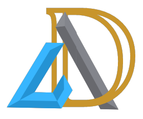

<!--   -->

# Todo Application MD   


This project is hosted on [Github Pages](https://github.com/D-Ankita/todoApp-redux-MD).

### Why MD
MD is the code word for frontEnd Rich Projects.\

## About this Projects
This Todo Application uses react redux concepts. It showcases the Traditional method of using redux -- before Redux Toolkit came into Picture.\
Plain CSS is used for styling.

## How to use
The Project uses localStorage of the Window object to store the Todos. Since every browser will have its own local storage.

This means that one can directly start using the Application without any need to install and run on local machine.

## To Download and run on local Machine
1. Clone the Repository
```
git clone https://github.com/D-Ankita/todoApp-redux-MD.git
```
2. Install all the required Dependencies
```
npm install
```

incase you face errors while installing, Install using
```
npm install --force
```
3. Run the file
```
npm start
```

This command Runs the app in the development mode.\
Open [http://localhost:3000](http://localhost:3000) to view it in your browser.


